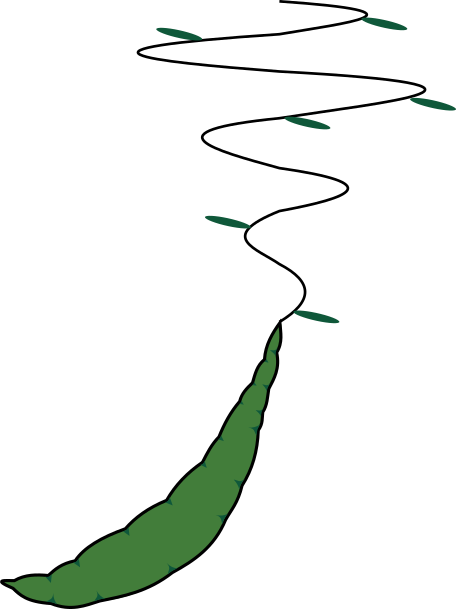

========
crowpeas
========



.. image:: https://img.shields.io/pypi/v/crowpeas.svg
    :target: https://pypi.python.org/pypi/crowpeas
    :scale: 50%
    :rotate: 90


.. image:: https://img.shields.io/travis/Ameyanagi/crowpeas.svg
        :target: https://travis-ci.com/Ameyanagi/crowpeas

.. image:: https://readthedocs.org/projects/crowpeas/badge/?version=latest
        :target: https://crowpeas.readthedocs.io/en/latest/?version=latest
        :alt: Documentation Status


EXAFS fitting using Neural Network


How to install
--------------

Please install PyTorch before installing crowpeas in order to use the GPU/TPU acceleration properly.
Follow the instruction in the following link to install PyTorch_.

.. _PyTorch: https://pytorch.org/get-started/locally/

Typical installation will be following:

```bash
pip install torch torchvision torchaudio --index-url https://download.pytorch.org/whl/cu124
```

Then, install crowpeas using pip:

```bash
pip install git+https://github.com/Ameyanagi/crowpeas
```

How to use (cli)
----------------
You first need to prepare the setting file.
The setting file can either be a toml or a json file. See Pd example.

run program with the following command:
```bash
crowpeas -d -t -v -e <config.toml>
```

